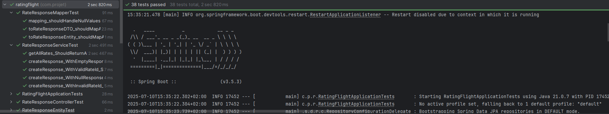

# rating-flight-ss Backend : Dev Installation

Ce projet est une application de gestion des évaluations de vols, permettant aux utilisateurs de noter leurs expériences de vol et aux compagnies aériennes de répondre à ces évaluations.

## I- Installation et Configuration

### 1. Prérequis
- Java 21
- Maven
- IDE (IntelliJ IDEA recommandé)
- Git

### 2. Installation

1. Cloner le repository :
```bash
git clone https://github.com/E1207/rating-flight-ss.git
```

2. Import dans IntelliJ IDEA :
- Ouvrir IntelliJ IDEA
- Choisir "Import Project" et sélectionner le répertoire cloné
- Importer comme projet Maven

3. Configuration Java :
- Dans IntelliJ : File > Project Structure... (Ctrl+Alt+Shift+S)
- Sélectionner "Project" sous "Project Settings"
- Configurer "Project SDK" sur Java 21
- Vérifier la configuration des Modules si nécessaire

4. Build du projet :
- Utiliser la configuration Maven rating-flight

## II- Architecture et Choix Techniques

### 1. Structure du Projet
Le projet suit une architecture en couches classique :
```
src/
├── main/
│   ├── java/
│   │   └── com/projet/ratingflight/
│   │       ├── controller/    # Contrôleurs REST
│   │       ├── service/       # Logique métier
│   │       ├── repository/    # Accès aux données
│   │       ├── datamodel/     # Entités et DTOs
│   │       └── configuration/ # Configuration Spring
│   └── resources/
│       ├── application.yml    # Configuration application
│       └── data.sql          # Données initiales
```

### 2. Modélisation des Données

#### Base de Données
Le choix est porté sur la Base de données H2 car elle est légère et facile à configurer pour le développement et les tests.
- Utilisation de H2 (base de données en mémoire)
- Je passe le projet à quelqu'un d'autre et il le lance sans avoir à faire grand chose
- Configuration dans application.yml :

#### Entités JPA
Hibernate est utilisé ici pour implémenter et gérer facilement les entités JPA.
Il va persister les objets java avec une base de données relationnelle(Notamment H2, dans notre cas).

Dans nos entités nous nous sommes gracieusement servis des annotations JPA et de Lombok pour reduire la taille de nos entités.

on a du :

@Entity pour indiquer que la classe est une entité JPA

@Table pour spécifier le nom de la table associée

@Id pour indiquer la clé primaire

@Data pour générer automatiquement les getters, setters, toString, equals et hashCode

@AllArgsConstructor pour générer un constructeur avec tous les arguments

@NoArgsConstructor pour générer un constructeur sans arguments

@Builder pour permettre la création d'instances de l'entité avec le pattern Builder

### 3. Pourquoi le @OneToMany
Dans notre cas, nous avons utilisé l'annotation `@OneToMany` pour établir une relation entre les entités `RateEntity` et `RateResponseEntity`. Cela signifie qu'une évaluation (`RateEntity`) peut avoir plusieurs réponses (`RateResponseEntity`). Cette relation est essentielle pour modéliser le fait qu'une compagnie aérienne peut répondre à plusieurs évaluations de vols.


### 4. Tests
Les bonnes pratiques ont étés respectées au mieux en faisant des tests qui couvrent tout le projet, garantissant ainsi sa maintenabilité et sa robustesse.

- Tests unitaires avec JUnit 5 et Mockito
- Tests d'intégration avec @SpringBootTest
- Couverture des services et controllers

On peut observer ici la couverture de code de l'application :


## III- Endpoints API

Pour exposer les données sur notre application, nous avons créé des endpoints RESTful pour gérer les évaluations de vols.
Voici quelques endpoints disponibles :
```
GET    /api/rates           # Liste toutes les évaluations
POST   /api/rates           # Crée une nouvelle évaluation
GET    /api/rates/{id}      # Récupère une évaluation
PATCH  /api/rates/{id}/status # Met à jour le statut
```
## IV- Outils et Frameworks utilisés
- Spring Boot 3.5.3
- H2 Database
- MapStruct
- Lombok
- JUnit 5
- Mockito

## V- Utilisation de l'IA

Pour la partie Backend, l'IA a été très peu utilisée car : 
On était sur un mini projet avec un CRUD relativement simplement, donc les services et controllers aussi 
sont relativement simples.

Mais l'IA a été utilisé, principalement ici dans :
- La génération du jeu de données initiales dans `data.sql` pour peupler la base de données H2 avec des données de test.
- La génration de la documentation ( commentaires )
- La génération des DTOs correspondant aux entités que j'ai créé précedemment.
- La génération des tests unitaires et d'intégration pour les services et contrôleurs, en mockant les données nécessaires.


